# AKS Flex Node - Architecture Documentation

## Table of Contents

- [Overview](#overview)
- [High-Level Architecture](#high-level-architecture)
- [System Components](#system-components)
- [Data Flow & Lifecycle](#data-flow--lifecycle)
- [Azure Integration](#azure-integration)
- [Security & Authentication](#security--authentication)
- [References](#references)

---

## Overview

AKS Flex Node transforms non-Azure Ubuntu VMs into fully managed Azure Kubernetes Service (AKS) worker nodes through Azure Arc integration.

**Key Technologies:**
- **Language:** Go 1.24+
- **Target Platform:** Ubuntu 22.04.5 LTS (x86_64)
- **Container Runtime:** containerd + runc
- **Kubernetes Components:** kubelet, kubectl, kubeadm
- **Azure Integration:** Azure Arc, Azure RBAC, Managed Identity

---

## High-Level Architecture

### System Overview

```mermaid
graph TB
    subgraph UserLayer["👤 User Layer"]
        Operator[Operator]
    end

    subgraph CloudLayer["☁️ Azure Cloud Services"]
        Arc[Azure Arc]
        AAD[Azure AD]
        RBAC[Azure RBAC]
        AKS[AKS Cluster]
    end

    subgraph VMLayer["💻 VM / Node"]
        Agent[AKS Flex Node Agent]
        ArcAgent[Arc Agent]
        Kubelet[kubelet]
        Containerd[containerd]
        CNI[CNI Plugins]
    end

    subgraph WorkloadLayer["📦 Workload"]
        Pods[Pods & Containers]
    end

    %% Phase 1: Identity Setup - Thick solid lines
    Operator ==>|"1: Start bootstrap"| Agent
    Agent ==>|"2: Register VM"| Arc
    Agent ==>|"3: Assign roles"| RBAC
    Arc ==>|"4: Create identity"| AAD

    %% Phase 2: Installation - Dashed lines
    Agent -.->|"5: Download config"| AKS
    Agent -.->|"6: Install Arc agent"| ArcAgent
    Agent -.->|"7: Install kubelet"| Kubelet
    Agent -.->|"8: Install containerd"| Containerd
    Agent -.->|"9: Install CNI"| CNI

    %% Phase 3: Activation - Thin solid lines
    RBAC -->|"10: Grant access"| AKS
    Kubelet -->|"11: Get token"| AAD
    Kubelet -->|"12: Join cluster"| AKS

    %% Runtime: Continuous - Dotted lines
    ArcAgent -..-|"Provide tokens"| Arc
    ArcAgent -..-|"Supply credentials"| Kubelet
    Kubelet -..-|"Report status"| AKS
    AKS -..-|"Schedule workloads"| Kubelet
    Kubelet -..-|"Manage containers"| Containerd
    Containerd -..-|"Network setup"| CNI
    Kubelet -..-|"Run pods"| Pods
    Pods -..-|"Execute in"| Containerd

    %% Styling
    classDef userStyle fill:#bbdefb,stroke:#0d47a1,stroke-width:3px,color:#000,font-weight:bold
    classDef cloudStyle fill:#fff3e0,stroke:#e65100,stroke-width:3px,color:#000,font-weight:bold
    classDef vmStyle fill:#c8e6c9,stroke:#1b5e20,stroke-width:3px,color:#000,font-weight:bold
    classDef workloadStyle fill:#e1bee7,stroke:#4a148c,stroke-width:3px,color:#000,font-weight:bold

    class Operator userStyle
    class Arc,AAD,RBAC,AKS cloudStyle
    class Agent,ArcAgent,Kubelet,Containerd,CNI vmStyle
    class Pods workloadStyle
```

**How to Read:**

- **Layers** (spatial - WHERE):
  - 👤 Blue = User Layer
  - ☁️ Yellow = Azure Cloud Services
  - 💻 Green = VM/Node
  - 📦 Purple = Workloads

- **Phases** (temporal - WHEN):
  - **⟹ Steps 1-4**: Identity Setup
  - **- - → Steps 5-9**: Installation
  - **→ Steps 10-12**: Activation
  - **···· Unlabeled**: Runtime (continuous)

### Operational Phases

**Phase 1: Identity Setup**
- Authenticate user credentials
- Register VM with Azure Arc (creates managed identity)
- Assign RBAC permissions to the identity

**Phase 2: Installation**
- Configure system (kernel settings, directories)
- Install container runtime (containerd + runc)
- Install Kubernetes components (kubelet, kubectl, kubeadm)
- Setup CNI networking plugins

**Phase 3: Activation**
- Download cluster configuration from AKS
- Configure kubelet to use Arc identity
- Start services (containerd, kubelet)
- Node joins cluster automatically

---

## System Components

### Component Responsibilities

| Component | What It Does | When It Runs |
|-----------|--------------|--------------|
| **AKS Flex Node Agent** | Orchestrates VM transformation | Bootstrap phase only |
| **Azure Arc Agent** | Manages VM identity and authentication | Bootstrap + Runtime |
| **Container Runtime** | Executes containerized applications | Runtime phase |
| **Kubelet** | Communicates with AKS control plane | Runtime phase |
| **CNI Plugins** | Enables pod-to-pod networking | Runtime phase |

### Component Interactions

**Bootstrap Sequence (①-⑧):** One-time setup
- User initiates transformation
- Agent registers with Arc (creates identity)
- Agent assigns RBAC permissions
- Agent downloads cluster configuration
- Agent installs runtime components

**Runtime Operations (⑨-⑬):** Ongoing interactions
- Arc Agent provides identity tokens
- Kubelet authenticates and registers with cluster
- Kubelet manages container lifecycle
- Containers use CNI for networking

---

## Data Flow & Lifecycle

### Bootstrap Workflow

### Phase Breakdown

**Phase 1: Identity Setup** (1-5 minutes)
- **Purpose**: Establish trust between VM and AKS cluster
- **Outcome**: VM has cloud identity with cluster permissions

**Phase 2: Installation** (5-10 minutes)
- **Purpose**: Prepare VM to run Kubernetes workloads
- **Outcome**: All required software installed and configured

**Phase 3: Activation** (1-2 minutes)
- **Purpose**: Connect VM to AKS cluster
- **Outcome**: Node is running and accepting workload assignments

**Runtime Operation** (Continuous)
- **Purpose**: Execute workloads assigned by cluster
- **Duration**: Until node is decommissioned

---

## Azure Integration

### Azure APIs Used

The agent calls these Azure APIs during bootstrap:

| Azure Service | API Purpose | Azure API Documentation |
|---------------|-------------|------------------------|
| **Azure Arc** | Register VM, get managed identity | [Hybrid Compute API](https://learn.microsoft.com/rest/api/hybridcompute/) |
| **Azure RBAC** | Assign cluster permissions | [Authorization API](https://learn.microsoft.com/rest/api/authorization/) |
| **Azure Container Service** | Download cluster credentials | [AKS API](https://learn.microsoft.com/rest/api/aks/) |
| **Azure AD** | Authenticate for API calls | [Azure Identity](https://learn.microsoft.com/azure/developer/go/azure-sdk-authentication) |

**What the agent does:**
1. Authenticates to Azure AD (Service Principal or Azure CLI)
2. Registers VM with Azure Arc → creates managed identity
3. Assigns RBAC roles to the managed identity
4. Downloads kubeconfig from AKS API
5. Configures kubelet to use Arc managed identity

---

## Security & Authentication

### Authentication Flow

**Bootstrap Phase:**
- Uses Service Principal OR Azure CLI credentials
- Authenticates to Azure AD
- Used for Arc registration, RBAC assignment, kubeconfig download

**Runtime Phase:**
- Kubelet uses Arc managed identity (HIMDS)
- Token script at `/var/lib/kubelet/token.sh`
- Auto-rotated, short-lived tokens

### Required Permissions

**User/Service Principal (Bootstrap):**
- `Azure Connected Machine Onboarding` - Register with Arc
- `User Access Administrator` or `Owner` - Assign RBAC roles
- `Azure Kubernetes Service Cluster Admin Role` - Download credentials

**Arc Managed Identity (Runtime):**
- `Azure Kubernetes Service Cluster User Role` - Assigned by agent during bootstrap

**Azure Docs:** [Azure RBAC Built-in Roles](https://learn.microsoft.com/azure/role-based-access-control/built-in-roles)

---

## References

### Azure Documentation
- [Azure Arc-enabled servers](https://learn.microsoft.com/azure/azure-arc/servers/overview)
- [Azure Arc managed identity](https://learn.microsoft.com/azure/azure-arc/servers/managed-identity-authentication)
- [Azure RBAC](https://learn.microsoft.com/azure/role-based-access-control/overview)
- [AKS REST API](https://learn.microsoft.com/rest/api/aks/)

### Kubernetes Documentation
- [Kubelet Configuration](https://kubernetes.io/docs/reference/command-line-tools-reference/kubelet/)
- [Exec Credential Plugin](https://kubernetes.io/docs/reference/access-authn-authz/authentication/#client-go-credential-plugins)
- [Node API](https://kubernetes.io/docs/reference/kubernetes-api/cluster-resources/node-v1/)

### Container Runtime Documentation
- [containerd](https://containerd.io/)
- [runc](https://github.com/opencontainers/runc)
- [CNI Specification](https://github.com/containernetworking/cni)

### Code Repository
- [AKS Flex Node Source Code](https://github.com/Azure/AKSFlexNode)
- [Azure SDK for Go](https://github.com/Azure/azure-sdk-for-go)

---

**Version:** 1.0
**Last Updated:** 2025-11-27
**Feedback:** [GitHub Issues](https://github.com/Azure/AKSFlexNode/issues)
