# AKS Flex Node Agent

<div align="center">


**Automate deployment, configuration, and management of AKS edge nodes with Azure Arc integration**

</div>

## Architecture Overview

AKS Flex Node enables edge Ubuntu VMs to securely join existing AKS clusters through Azure Arc authentication and VPN connectivity.

### High-Level Architecture

```mermaid
graph TB
    subgraph Azure ["☁️ Azure Cloud Environment"]
        direction TB
        subgraph AKS_RG ["AKS Resource Group"]
            AKS["🔒 AKS Cluster<br/>(Private Endpoints)"]
            VNet["🌐 Virtual Network<br/>(10.0.0.0/16)"]
        end

        subgraph Arc_Service ["Azure Arc Services"]
            Arc["🔗 Arc for Servers<br/>(Managed Identity)"]
            HIMDS["🎫 HIMDS Endpoint<br/>(Token Provider)"]
        end

        subgraph Network_Layer ["Network Infrastructure"]
            VPN["🚪 VPN Gateway<br/>(Point-to-Site)"]
            PublicIP["📡 Public IP<br/>(Gateway Access)"]
        end

        ARM["⚙️ Azure Resource Manager<br/>(RBAC & Permissions)"]
    end

    subgraph Edge ["🏢 Edge Location"]
        direction TB
        VM["💻 Ubuntu VM<br/>(Edge Node)"]

        subgraph Agent_Stack ["Agent Components"]
            FlexAgent["🤖 aks-flex-node<br/>(Main Agent)"]
            ArcAgent["🔌 Arc Agent<br/>(azcmagent)"]
        end

        subgraph K8s_Stack ["Kubernetes Stack"]
            Kubelet["☸️ kubelet<br/>(Node Agent)"]
            Containerd["📦 containerd<br/>(Container Runtime)"]
            CNI["🔌 CNI Plugins<br/>(Networking)"]
        end

        subgraph VPN_Client ["VPN Client"]
            OpenVPN["🔐 OpenVPN<br/>(P2S Connection)"]
            TunInterface["🌉 tun0<br/>(192.168.100.x)"]
        end
    end

    %% Connections
    VM --> FlexAgent
    FlexAgent --> ArcAgent
    FlexAgent --> Kubelet
    FlexAgent --> OpenVPN

    Kubelet --> Containerd
    Kubelet --> CNI

    %% Arc Authentication Flow
    ArcAgent -.->|"🔐 Register & Auth"| Arc
    Arc -.->|"🎫 Azure AD Tokens"| HIMDS
    HIMDS -.->|"🔑 ARM Access"| ARM

    %% VPN Connection Flow
    OpenVPN -.->|"🔒 Encrypted Tunnel"| VPN
    VPN -.->|"📡 Internet"| PublicIP
    TunInterface -.->|"🌐 Private Network"| VNet

    %% Kubernetes Communication
    Kubelet -.->|"☸️ Cluster Join"| AKS
    AKS -.->|"📦 Workload Scheduling"| Kubelet

    %% Styling
    classDef azure fill:#0078D4,stroke:#005A9B,stroke-width:2px,color:#fff
    classDef edge fill:#28A745,stroke:#1E7E34,stroke-width:2px,color:#fff
    classDef network fill:#17A2B8,stroke:#117A8B,stroke-width:2px,color:#fff
    classDef security fill:#FFC107,stroke:#E0A800,stroke-width:2px,color:#000

    class Azure,AKS_RG,Arc_Service,Network_Layer azure
    class Edge,Agent_Stack,K8s_Stack,VPN_Client edge
    class VPN,OpenVPN,TunInterface network
    class Arc,HIMDS,ARM security
```



### Component Breakdown

| Component | Purpose | Location | Status |
|-----------|---------|----------|---------|
| **🤖 aks-flex-node** | Main orchestration agent | Edge VM | Active |
| **🔗 Azure Arc** | Identity & authentication | Azure Cloud | Managed |
| **🚪 VPN Gateway** | Secure network tunnel | Azure VNet | Auto-provisioned |
| **☸️ kubelet** | Kubernetes node agent | Edge VM | Managed by agent |
| **📦 containerd** | Container runtime | Edge VM | Managed by agent |

### Data Flow

```mermaid
sequenceDiagram
    participant E as 💻 Edge VM
    participant A as 🤖 aks-flex-node
    participant Arc as 🔗 Azure Arc
    participant V as 🚪 VPN Gateway
    participant K as ☸️ AKS Cluster

    Note over E,K: 1. Initial Setup Phase
    E->>A: Start agent
    A->>Arc: Register with Arc
    Arc-->>A: Managed identity created

    Note over E,K: 2. VPN Bootstrap Phase
    A->>V: Auto-provision gateway
    V-->>A: VPN profile generated
    A->>E: Configure OpenVPN client
    E->>V: Establish secure tunnel

    Note over E,K: 3. Kubernetes Join Phase
    A->>K: Request cluster credentials
    K-->>A: Provide kubeconfig
    A->>E: Configure kubelet
    E->>K: Join as worker node

    Note over E,K: 4. Runtime Operations
    K->>E: Schedule workloads
    E->>K: Report node status
    E->>K: Stream logs & metrics
```



## Quick Start

### One-Command Setup Flow

```bash
# Step 0
az login

# Step 1: Register with Azure Arc
sudo aks-flex-node arc register

# Step 2: Check Arc status
sudo aks-flex-node arc status

# Step 3: Verify Arc agent
azcmagent show

# Step 4: Bootstrap VPN connection
sudo aks-flex-node bootstrap-vpn --auto-provision

# Step 5: Bootstrap Kubernetes node
sudo aks-flex-node bootstrap-node

# Reset if needed to disconnect vm from cluster
sudo aks-flex-node reset
```

## Installation

### Prerequisites

```bash
# Update system
sudo apt update && sudo apt upgrade -y

# Install Go 1.21+
wget https://go.dev/dl/go1.21.5.linux-amd64.tar.gz
sudo rm -rf /usr/local/go
sudo tar -C /usr/local -xzf go1.21.5.linux-amd64.tar.gz
echo 'export PATH=$PATH:/usr/local/go/bin' >> ~/.bashrc
source ~/.bashrc

# Install Azure CLI
curl -sL https://aka.ms/InstallAzureCLIDeb | sudo bash
az login
```

### Build & Install

```bash
# Clone repository
git clone <repository-url>
cd AKSFlexNode

# Build binary
make build

# Install
sudo make install

# Verify installation
aks-flex-node version
```

## Configuration

### Basic Configuration Template

```yaml
# /etc/aks-flex-node/config.yaml
azure:
  subscriptionId: "<your_subscription_ID>"
  tenantId: "<your_tenant_ID>"
  location: "<location>"
  resourceGroup: "<your_resource_group>"
  arc:
    autoRegister: true
    targetCluster:
      name: "<your_cluster_name>"
      # resourceGroup: "" // only needed if different from the above resourceGroup
  vpn:
    enabled: true
    autoProvision: true
    p2sGatewayCIDR: "192.168.100.0/24"    # VPN client address pool
    gatewaySKU: "VpnGw2AZ"

node:
  labels:
    node-type: "edge"
    location: "edge-site-1"

agent:
  logLevel: "info"
  logFile: "/var/log/aks-flex-node/agent.log"

paths:
  configDir: "/etc/aks-flex-node"
  dataDir: "/var/lib/aks-flex-node"
  logDir: "/var/log/aks-flex-node"
  kubernetes:
    configDir: "/etc/kubernetes"
    certsDir: "/etc/kubernetes/certs"
    manifestsDir: "/etc/kubernetes/manifests"
    volumePluginDir: "/etc/kubernetes/volumeplugins"
    kubeletDir: "/var/lib/kubelet"
  cni:
    binDir: "/opt/cni/bin"
    confDir: "/etc/cni/net.d"
    libDir: "/var/lib/cni"

containerd:
  version: "1.7.20"
  pauseImage: "mcr.microsoft.com/oss/kubernetes/pause:3.6"
  metricsAddress: "0.0.0.0:10257"

kubernetes:
  version: "1.32.7"
  urlTemplate: "https://acs-mirror.azureedge.net/kubernetes/v%s/binaries/kubernetes-node-linux-%s.tar.gz"

runc:
  version: "1.1.12"
  url: "https://github.com/opencontainers/runc/releases/download/v1.1.12/runc.amd64"

```

## State Management

The agent uses idempotent state tracking to resume from failures:


## Commands

### Core Commands

| Command | Description | Component |
|---------|-------------|-----------|
| `arc register` | Register with Azure Arc | Arc |
| `arc status` | Check Arc registration status | Arc |
| `bootstrap-vpn` | Setup VPN connection | VPN |
| `bootstrap-node` | Bootstrap Kubernetes components | K8s |
| `status` | Show overall agent status | Agent |
| `reset` | Reset node configuration | System |
| `version` | Show version info | System |

## Security Model


## Monitoring & Status

### Status Dashboard

```bash
# Complete system status
aks-flex-node status --json | jq '
{
  "arc_status": .arc.status,
  "vpn_status": .vpn.status,
  "node_status": .node.status,
  "last_update": .timestamp
}'
```

## Troubleshooting

### Common Issues & Solutions

| Issue | Symptom | Solution | Component |
|-------|---------|----------|-----------|
| Arc Registration Failed | `arc status` shows error | Check Azure CLI login | Arc |
| VPN Connection Failed | No tunnel interface | Verify gateway settings | VPN |
| Node Not Joining | `kubectl get nodes` missing | Check network connectivity | K8s |
| Certificate Issues | TLS errors in logs | Regenerate certificates | Security |


## Lifecycle Management

### Service Management

```bash
# Install as systemd service
sudo systemctl enable aks-flex-node
sudo systemctl start aks-flex-node
sudo systemctl status aks-flex-node

# View service logs
sudo journalctl -u aks-flex-node -f
```

### Updates & Maintenance

```bash
# Update binary
sudo systemctl stop aks-flex-node
sudo cp new-aks-flex-node /usr/local/bin/
sudo systemctl start aks-flex-node

# Health check after update
aks-flex-node health
aks-flex-node status
```

## Documentation

- [Development Guide](docs/DEVELOPMENT.md)
- [Configuration Reference](docs/CONFIGURATION.md)
- [Setup Guide](docs/AKS_EDGE_NODE_SETUP_GUIDE.md)
- [Troubleshooting](docs/TROUBLESHOOTING.md)
- [APT Packaging](docs/APT_PACKAGING_GUIDE.md)

## Contributing

1. Fork the repository
2. Create your feature branch (`git checkout -b feature/amazing-feature`)
3. Commit your changes (`git commit -m 'Add amazing feature'`)
4. Push to the branch (`git push origin feature/amazing-feature`)
5. Open a Pull Request

## License

This project is licensed under the MIT License - see the [LICENSE](LICENSE) file for details.

## Support

- Report issues: [GitHub Issues](https://github.com/your-org/AKSFlexNode/issues)
- Discussion: [GitHub Discussions](https://github.com/your-org/AKSFlexNode/discussions)
- Email: support@yourorg.com

---

<div align="center">

**Made with ❤️ for Azure Edge Computing**


</div>