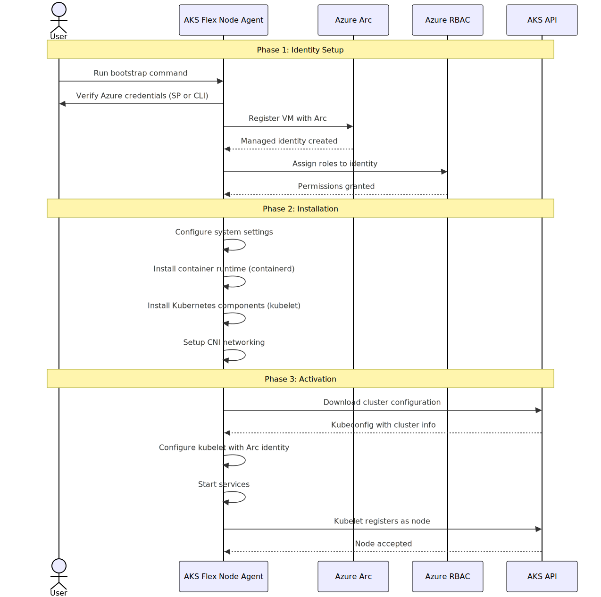

# Diagrams

This directory contains both the mermaid source files (`.mmd`) and generated SVG diagrams for the design documentation.

## Mermaid Source Files

- `system-overview.mmd` - Complete system architecture diagram showing bootstrap and runtime interactions
- `bootstrap-workflow.mmd` - Sequence diagram of bootstrap workflow

## Generated SVG Files

- `system-overview.svg`
- `bootstrap-workflow.svg`

## Regenerating SVG Files

When you update a mermaid source file, regenerate the corresponding SVG:

```bash
# From the diagrams directory
./generate.sh

# Or regenerate a specific diagram
mmdc -i system-overview.mmd -o system-overview.svg -b transparent
```

## Requirements

Install mermaid-cli to generate SVG files:

```bash
npm install -g @mermaid-js/mermaid-cli
```

## Usage in Documentation

The SVG files are referenced in `docs/design.md` as:

```markdown


```
