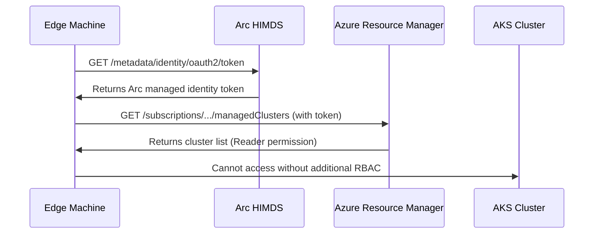

# Simplified Guide: AKS Edge Node Setup with Azure Arc Integration

This guide provides streamlined instructions for joining an edge Ubuntu VM to an existing AKS cluster using the aks-flex-node with Azure Arc integration. The Arc integration dramatically reduces manual configuration by providing automated cluster discovery, authentication, and permission management.

## Prerequisites

- Azure CLI installed and logged in
- Azure subscription with appropriate permissions for Arc and AKS
- Ubuntu VM (18.04+ or 20.04+) for the edge node
- Existing AKS cluster (or use Part 1 to create one)
- **Azure Arc for Servers** enabled in your subscription

## Architecture Overview

```
┌─────────────────────────────────────────────────────────────┐
│                    Azure Cloud                              │
│  ┌─────────────────┐    ┌─────────────────────────────────┐ │
│  │   AKS Cluster   │    │       Azure Arc Service         │ │
│  │   (Private)     │    │  ┌─────────────────────────────┐ │ │
│  │  ┌───────────┐  │    │  │   Arc for Servers          │ │ │
│  │  │ Master    │  │    │  │  - Managed Identity        │ │ │
│  │  │ Nodes     │  │    │  │  - Authentication         │ │ │
│  │  └───────────┘  │    │  │  - RBAC Management        │ │ │
│  └─────────────────┘    │  └─────────────────────────────┘ │ │
│           │              │                                   │
│  ┌─────────────────┐    │                                   │
│  │  VPN Gateway    │    │                                   │
│  │  (Required for  │    │                                   │
│  │  connectivity)  │    │                                   │
│  └─────────────────┘    │                                   │
└─────────────────────────┼────────────────────────────────────┘
                          │
                          │ Arc Auth + VPN/ExpressRoute for
                          │ actual cluster connectivity
                          │
                 ┌────────▼──────────┐
                 │   Edge Ubuntu VM  │
                 │                   │
                 │  aks-node-        │
                 │  controller       │
                 │  + Arc Agent      │
                 │                   │
                 └───────────────────┘
```

## Part 1: Azure Infrastructure Setup (Optional)

> **Note:** If you already have an existing AKS cluster, skip to Part 2.

### Step 1: Quick AKS Cluster Creation

```bash
# Set variables
RESOURCE_GROUP="wenx-rg"
LOCATION="eastus"
CLUSTER_NAME="wenx-edge-cluster"

# Create resource group and AKS cluster in one step
az group create --name $RESOURCE_GROUP --location $LOCATION

# Create a simple AAD AKS cluster
az aks create \
    --resource-group $RESOURCE_GROUP \
    --name $CLUSTER_NAME \
    --node-count 1 \
    --node-vm-size standard_d12_v2 \
    --enable-managed-identity \
    --network-plugin none \
    --enable-aad \
    --enable-azure-rbac \
    --aad-admin-group-object-ids 8a5603a8-2c60-49ab-bc28-a989b91e187d \
    --generate-ssh-keys

# Get AKS credentials
az aks get-credentials \
    --resource-group $RESOURCE_GROUP \
    --name $CLUSTER_NAME
```

## Part 2: Network Connectivity Requirements

> **Important:** Azure Arc provides authentication and management capabilities, but **does not provide the network connectivity required for Kubernetes cluster membership**. When an edge node joins an AKS cluster, it needs:
>
> - **Pod-to-Pod Communication**: Direct network access to pods running on AKS nodes
> - **Service Discovery**: Access to cluster DNS and service endpoints
> - **Container Registry Access**: Ability to pull container images
> - **Kubernetes API Access**: Connection to the cluster control plane
>
> This requires **Layer 3 network connectivity** between the edge location and Azure VNet, typically provided by VPN, ExpressRoute, or public endpoints.

### Choose Your Connectivity Option:

Since Kubernetes cluster membership requires **pod-to-pod communication** across all nodes, you must establish Layer 3 network connectivity between your edge location and the Azure VNet. Here are your options:

**Option A: VPN Gateway (Most Common for Production) - Automated by aks-flex-node**
- aks-flex-node can automatically set up Point-to-Site VPN connection
- Generates certificates, configures OpenVPN client, manages IP updates
- Edge machine gets private IP in Azure address space
- Enables secure pod-to-pod communication with private AKS nodes
- **Pros**: Secure, production-ready, cost-effective, **automated setup**
- **Cons**: Requires initial Azure VPN Gateway configuration
- **Use case**: Most production edge deployments
- **Commands**: `bootstrap-vpn` or `vpn generate-certs` + manual Azure setup

**Option B: ExpressRoute (Enterprise)**
- Dedicated private connection to Azure
- Highest performance and reliability for pod-to-pod traffic
- **Pros**: Guaranteed bandwidth, lowest latency, most secure
- **Cons**: Higher cost, longer setup time
- **Use case**: Mission-critical edge deployments, high-throughput workloads

For this guide, we'll assume you have established connectivity using one of these options. **Note**: If you choose VPN Gateway, the automated VPN setup will be covered after Arc registration in Part 5.

## Part 3: Edge Ubuntu VM Setup with Arc Integration

> **What Arc Provides Automatically:**
> - **Managed Identity**: System-assigned identity for the edge machine
> - **Azure Authentication**: Token access via Arc HIMDS endpoint
> - **Subscription Reader**: Can discover and list AKS clusters
> - **Certificate Management**: No manual cert generation needed
>
> **What Still Requires Setup:**
> - **Network Connectivity**: VPN, ExpressRoute, or public endpoints
> - **AKS Cluster Permissions**: Manual RBAC role assignment for cluster access
> - **Container Registry Access**: ACR permissions if using private registries

### Step 1: Basic Ubuntu VM Preparation

Connect to your Ubuntu VM and run the following commands:

```bash
# Update system
sudo apt update && sudo apt upgrade -y

# Install basic dependencies
sudo apt install -y curl wget jq git net-tools

# Install Go (required for building aks-flex-node)
wget https://go.dev/dl/go1.21.5.linux-amd64.tar.gz
sudo rm -rf /usr/local/go
sudo tar -C /usr/local -xzf go1.21.5.linux-amd64.tar.gz
echo 'export PATH=$PATH:/usr/local/go/bin' >> ~/.bashrc
source ~/.bashrc

# Install az CLI
curl -sL https://aka.ms/InstallAzureCLIDeb | sudo bash
az --version
az login
az account set -s 8ecadfc9-d1a3-4ea4-b844-0d9f87e4d7c8

az extension add --name connectedmachine --allow-preview

```

### Step 2: Install aks-flex-node

```bash
# Clone and build aks-flex-node
git clone <repository-url>
cd aks-flex-node

# Install the binary
go build ./cmd/aks-flex-node
sudo cp aks-flex-node /usr/local/bin/
sudo chmod +x /usr/local/bin/aks-flex-node

# Verify installation
aks-flex-node version
```

### Step 3: Create Cluster-Specific Configuration

Create a configuration file `/etc/aks-flex-node/config.yaml` that targets a specific AKS cluster:

```bash
SUBSCRIPTION_ID=$(az account show --query id -o tsv)
TENANT_ID=$(az account show --query tenantId -o tsv)
# replace with your target cluster name
CLUSTER_NAME="wenx-edge-cluster"
RESOURCE_GROUP="wenx-rg"

LOCATION="eastus"

sudo mkdir -p /etc/aks-flex-node

sudo tee /etc/aks-flex-node/config.yaml > /dev/null <<EOF
azure:
  subscriptionId: "${SUBSCRIPTION_ID}"
  tenantId: "${TENANT_ID}"
  location: "eastus"
  resourceGroup: "${RESOURCE_GROUP}"
  arc:
    autoRegister: true
    autoDiscover: true
    targetCluster:
      name: "${CLUSTER_NAME}"
      # resourceGroup: "${CLUSTER_RG}"

node:
  labels:
    node-type: "edge"
    location: "edge-site-1"

agent:
  logLevel: "info"
  logFile: "/var/log/aks-flex-node/agent.log"
EOF
```

> **Security Note**: By specifying `targetCluster.name`, the Arc managed identity will only be granted permissions to the specific AKS cluster. This follows the principle of least privilege.

## Part 4: Arc Registration (Required First Step)

Before setting up VPN or connecting to AKS clusters, the edge VM must be registered as an Azure Arc machine. This provides the managed identity needed for subsequent operations.

### Step 4: Register with Azure Arc

The Arc registration process involves two steps: installing the Arc agent and registering the machine.

**Option A: Use bootstrap-arc (recommended)**
```bash
# This installs the Arc agent and registers the machine in one command
sudo aks-flex-node bootstrap-arc
```

**Option B: Step-by-step approach**
```bash
# Register this machine with Azure Arc (includes agent installation)
sudo aks-flex-node arc register

# Verify Arc registration
sudo aks-flex-node arc status
```

This will:
- Install the Azure Arc agent
- Register the machine with Azure Arc service
- Create a system-assigned managed identity

## Part 5: Optional VPN Setup

If you chose **Option A (VPN Gateway)** for connectivity, aks-flex-node can automatically provision the VPN Gateway in your AKS cluster's VNet and set up the VPN connection.

### Automatic VPN Gateway Provisioning

**Prerequisites:**
- You must be logged in with Azure CLI (`az login`)
- Your account needs `Owner` or `User Access Administrator` role on the target resource group

**What Happens Automatically:**
1. Grants Arc managed identity `Reader` role on the specific AKS cluster
2. Grants Arc managed identity `Network Contributor` role on the resource group
3. Proceeds with VPN Gateway provisioning immediately

**Complete VPN Setup with Auto-Provisioning:**
```bash
# 1. Enable VPN Gateway auto-provisioning in config
SUBSCRIPTION_ID=$(az account show --query id -o tsv)
TENANT_ID=$(az account show --query tenantId -o tsv)
# replace with your target cluster name
CLUSTER_NAME="wenx-edge-cluster"
RESOURCE_GROUP="wenx-rg"

LOCATION="eastus"

sudo mkdir -p /etc/aks-flex-node

sudo tee /etc/aks-flex-node/config.yaml > /dev/null <<EOF
azure:
  subscriptionId: "${SUBSCRIPTION_ID}"
  tenantId: "${TENANT_ID}"
  location: "eastus"
  resourceGroup: "${RESOURCE_GROUP}"
  arc:
    autoRegister: true
    targetCluster:
      name: "${CLUSTER_NAME}"
      # resourceGroup: "${CLUSTER_RG}"
  vpn:
    enabled: true
    autoProvision: true
    p2sGatewayCIDR: "192.168.100.0/24"    # VPN client address pool
    gatewaySKU: "VpnGw2AZ"

node:
  labels:
    node-type: "edge"
    location: "edge-site-1"

agent:
  logLevel: "info"
  logFile: "/var/log/aks-flex-node/agent.log"

paths:
  configDir: "/etc/aks-flex-node"
  dataDir: "/var/lib/aks-flex-node"
  logDir: "/var/log/aks-flex-node"
  kubernetes:
    configDir: "/etc/kubernetes"
    certsDir: "/etc/kubernetes/certs"
    manifestsDir: "/etc/kubernetes/manifests"
    volumePluginDir: "/etc/kubernetes/volumeplugins"
    kubeletDir: "/var/lib/kubelet"
  cni:
    binDir: "/opt/cni/bin"
    confDir: "/etc/cni/net.d"
    libDir: "/var/lib/cni"

containerd:
  version: "1.7.20"
  pauseImage: "mcr.microsoft.com/oss/kubernetes/pause:3.6"
  metricsAddress: "0.0.0.0:10257"

kubernetes:
  version: "1.32.7"
  urlTemplate: "https://acs-mirror.azureedge.net/kubernetes/v%s/binaries/kubernetes-node-linux-%s.tar.gz"

runc:
  version: "1.1.12"
  url: "https://github.com/opencontainers/runc/releases/download/v1.1.12/runc.amd64"
EOF

# 2. Auto-provision VPN Gateway and bootstrap connection
sudo aks-flex-node bootstrap-vpn --auto-provision
```

**What This Does Automatically:**
1. **Discovers AKS VNet**: Extracts VNet information from target cluster configuration
2. **Creates GatewaySubnet**: Adds `/27` subnet to the AKS VNet if not present
3. **Provisions Public IP**: Creates zone-redundant Standard public IP for gateway
4. **Creates VPN Gateway**: Deploys VpnGw2AZ gateway with Point-to-Site configuration
5. **Generates Certificates**: Creates self-signed certificates for P2S authentication
6. **Configures OpenVPN**: Downloads profile and establishes VPN connection
7. **Updates Node IP**: Configures edge node to use VPN IP for cluster communication

---

## Part 6: Arc-Powered AKS Bootstrap

### Step 5: Connect to Target AKS Cluster

With cluster-specific configuration, the Arc integration follows a secure, targeted approach:

**Option A: Automated Bootstrap (Recommended)**
```bash
# Bootstrap Arc registration and connect to target cluster
sudo aks-flex-node bootstrap-arc

# Generate cluster-specific permission script for administrators
sudo aks-flex-node arc setup-permissions --generate-script --script-path /tmp/setup-permissions.sh

# After permissions are granted, verify connection
sudo aks-flex-node arc status
```

**Option B: Step-by-step approach**
```bash
# 1. Register with Arc (if not done with bootstrap-arc)
sudo aks-flex-node arc register

# 2. Connect to configured target cluster
sudo aks-flex-node arc discover --auto-connect

# 3. Generate permission script
sudo aks-flex-node arc setup-permissions --generate-script --script-path /tmp/setup-permissions.sh
```

### Step 6: Verify Arc Integration and Node Status

```bash
# Check Arc registration status
sudo aks-flex-node arc status

# View detailed Arc and cluster information
sudo aks-flex-node arc status --json

# Check overall node health
sudo aks-flex-node health

# Check Kubernetes services
sudo systemctl status kubelet
sudo systemctl status containerd

# View logs if needed
sudo journalctl -u kubelet -f
```

### Step 7: Verify Node Registration in AKS

From your local machine with kubectl access:

```bash
# Check if the edge node has joined the cluster
kubectl get nodes

# Look for your edge node with labels
kubectl get nodes --show-labels

# Check node details
kubectl describe node YOUR_EDGE_NODE_NAME

# Verify the node can schedule pods
kubectl get nodes -o custom-columns=NAME:.metadata.name,STATUS:.status.conditions[-1].type,ROLES:.metadata.labels.kubernetes\\.io/role
```

## Part 6: Testing and Validation

### Step 8: Deploy Test Workload

Create a test deployment that will run on the edge node:

```yaml
# Save as edge-test-pod.yaml
apiVersion: v1
kind: Pod
metadata:
  name: edge-test-pod
  labels:
    app: edge-test
spec:
  nodeSelector:
    node-type: "edge"
  containers:
  - name: nginx
    image: nginx:latest
    ports:
    - containerPort: 80
    resources:
      requests:
        memory: "64Mi"
        cpu: "50m"
      limits:
        memory: "128Mi"
        cpu: "100m"
```

```bash
# Apply the test pod
kubectl apply -f edge-test-pod.yaml

# Check if it's scheduled on the edge node
kubectl get pods -o wide

# Check pod logs
kubectl logs edge-test-pod
```

### Step 9: Network Connectivity Test

```bash
# Test pod-to-pod communication
kubectl run test-client --image=busybox --rm -it --restart=Never -- /bin/sh

# Inside the test client, test connectivity
# nslookup kubernetes.default.svc.cluster.local
# ping edge-test-pod-ip
```

## Part 4: Advanced Arc Management Commands

### Cluster Discovery and Management

```bash
# Discover all AKS clusters in your subscription
sudo aks-flex-node arc discover

# Discover clusters with filtering
sudo aks-flex-node arc discover \
    --location "eastus" \
    --name-pattern "production" \
    --auto-connect

# Discover clusters by tags
sudo aks-flex-node arc discover \
    --tag-key "environment" \
    --tag-value "production"
```

### Arc Registration Commands

```bash
# Register this machine with Arc (included in bootstrap-arc)
sudo aks-flex-node arc register

# Check Arc registration status with aks-flex-node
sudo aks-flex-node arc status
```

### Permission Management

```bash
# Generate RBAC permission script for manual execution
sudo aks-flex-node arc setup-permissions --generate-script --script-path /tmp/permissions.sh

# The generated script can then be executed by administrators:
sudo bash /tmp/permissions.sh
```


## Part 6: Ongoing Management

### Set Up Systemd Service

Create a systemd service for automatic startup:

```bash
sudo tee /etc/systemd/system/aks-flex-node.service > /dev/null <<EOF
[Unit]
Description=AKS Flex Node Agent
Documentation=https://github.com/your-org/aks-flex-node
After=network.target local-fs.target
Wants=network.target

[Service]
Type=simple
User=root
ExecStart=/usr/local/bin/aks-flex-node daemon --config /etc/aks-flex-node/config.yaml
Restart=always
RestartSec=10
KillMode=process
TimeoutSec=300

# Logging
StandardOutput=journal
StandardError=journal
SyslogIdentifier=aks-flex-node

# Security
NoNewPrivileges=true
ProtectSystem=full

[Install]
WantedBy=multi-user.target
EOF

# Enable and start the service
sudo systemctl daemon-reload
sudo systemctl enable aks-flex-node
sudo systemctl start aks-flex-node

# Check service status
sudo systemctl status aks-flex-node
```

### Set Up Log Rotation

```bash
sudo tee /etc/logrotate.d/aks-flex-node > /dev/null <<EOF
/var/log/aks-flex-node/*.log {
    daily
    missingok
    rotate 30
    compress
    delaycompress
    notifempty
    create 0644 root root
    postrotate
        systemctl reload aks-flex-node 2>/dev/null || true
    endscript
}
EOF
```

## Troubleshooting

### Common Arc Integration Issues

#### Arc Agent Issues

```bash
# Check Arc agent and registration status with aks-flex-node
sudo aks-flex-node arc status --json

# This provides comprehensive Arc health information
# If issues are found, check individual system services
sudo systemctl status himdsd
sudo journalctl -u himdsd -f
```

#### Authentication Issues

```bash
# Test Arc managed identity authentication
sudo aks-flex-node arc status --json

# This automatically tests managed identity token retrieval
# If authentication fails, check Azure CLI as fallback:
az account show
az aks list --output table
```

#### Cluster Discovery Issues

```bash
# Test automated cluster discovery
sudo aks-flex-node arc discover --location "eastus"

# This uses Arc managed identity automatically
# For manual verification if needed:
az aks list --resource-group $RESOURCE_GROUP
```

#### Node Registration Issues

```bash
# Check comprehensive node health including Kubernetes services
sudo aks-flex-node health --json

# Check kubelet and aks-flex-node logs if issues found
sudo journalctl -u kubelet -f
sudo journalctl -u aks-flex-node -f
```

## Maintenance Tasks

### Regular Maintenance

```bash
# Update node IP if VPN IP changes (automated by aks-flex-node)
sudo aks-flex-node update-node-ip --interface tun0

# Check comprehensive node health
sudo aks-flex-node health --json

# View detailed agent and Arc status
sudo aks-flex-node status --json
sudo aks-flex-node arc status --json

# Restart services if needed
sudo systemctl restart aks-flex-node
```

### Updating the Node

```bash
# Stop the agent
sudo systemctl stop aks-flex-node

# Update aks-flex-node binary
# (download new version and replace)

# Restart the agent
sudo systemctl start aks-flex-node

# Verify update
aks-flex-node version
```

## Security Considerations

1. **VPN Certificates**: Store certificates securely and rotate them regularly
2. **Node Access**: Limit SSH access to the edge node
3. **Network Security**: Use Azure NSGs to control traffic
4. **Updates**: Keep the Ubuntu VM and aks-flex-node updated
5. **Monitoring**: Set up monitoring for the edge node and VPN connection

## Cleanup

To remove all resources:

```bash
# Reset the node (includes Arc unregistration and cleanup)
sudo aks-flex-node reset --force

# Delete Azure resources if no longer needed
az group delete --name $RESOURCE_GROUP --yes --no-wait
```

## Appendix: Technical Details

### Understanding Cluster-Specific Arc Permission Model

With the new cluster-specific approach, Arc registration and permissions are handled differently:

#### **Arc Registration Process:**
```bash
# 1. System-assigned managed identity is created
Identity: /subscriptions/{sub}/resourceGroups/{rg}/providers/Microsoft.HybridCompute/machines/{machine}

# 2. NO automatic subscription-level permissions are granted
# This eliminates security risks from broad access

# 3. Access is granted only to specific cluster via RBAC assignments:
Scope: /subscriptions/{sub}/resourceGroups/{rg}/providers/Microsoft.ContainerService/managedClusters/{cluster}
```

#### **Required Cluster-Specific Permissions:**
```bash
# ✅ These permissions are granted only to the target cluster:
POST .../managedClusters/{target-cluster}/listClusterUserCredential     # Get kubeconfig
POST .../managedClusters/{target-cluster}/listClusterAdminCredential    # Get admin kubeconfig
PUT  .../managedClusters/{target-cluster}/agentPools/{pool}             # Join as node

# ❌ Access to other clusters is blocked:
POST .../managedClusters/{other-cluster}/listClusterUserCredential      # ❌ Forbidden
```

### Token Authentication Flow



### How Cluster-Specific Arc Improves Security

**Enhanced Security Benefits:**
1. **Managed Identity**: Automatically created during registration (same as before)
2. **Token Provider**: Arc HIMDS provides Azure ARM tokens (same as before)
3. **Zero Subscription Access**: NO automatic subscription-level permissions (improved)
4. **Targeted Access**: Only specified cluster can be accessed (new)
5. **No Certificates**: Uses Azure AD tokens instead of client certificates (same as before)

**Still Requires Manual Setup:**
1. **Cluster-Specific Permissions**: Must be manually granted to target cluster only
2. **Kubernetes RBAC**: Must be configured for node join
3. **Network Access**: Must be established separately

**Security Improvements:**
- **Reduced Blast Radius**: Compromised edge node cannot access other clusters
- **Explicit Access**: Each cluster connection must be explicitly approved
- **Better Compliance**: Meets zero-trust and least-privilege requirements

## Summary

This simplified guide covered:

1. **Azure Infrastructure** (Optional): Quick AKS cluster creation
2. **Network Connectivity Planning**: Understanding connectivity options
3. **Edge VM Preparation**: Basic Ubuntu setup and aks-flex-node installation
4. **Arc Registration**: Establishing Azure Arc managed identity
5. **Optional VPN Setup**: Automated VPN configuration for private clusters
6. **Arc-Powered AKS Bootstrap**: Single command (`bootstrap-arc`) automation
7. **Permission Setup**: One-time RBAC configuration
8. **Testing and Validation**: Ensuring proper node integration

## Key Simplifications with Arc Integration

**Before Arc (Manual Process):**
- ❌ 20+ manual steps
- ❌ Manual VPN Gateway setup (20-45 minutes)
- ❌ Manual certificate generation and management
- ❌ Manual cluster configuration discovery
- ❌ Complex authentication setup
- ❌ Manual kubeconfig management

**After Arc + Cluster-Specific Security + VPN Automation:**
- ✅ **6 simple steps** (plus optional automated VPN setup)
- ✅ **Single `bootstrap-arc` command** handles authentication & target cluster access
- ✅ **Automated VPN setup** with `bootstrap-vpn` command
- ✅ **Cluster-specific targeting** (no subscription-level permissions)
- ✅ **Managed identity authentication** (no manual certificates)
- ✅ **Auto-generated RBAC scripts** for cluster-specific permission setup
- ✅ **Built-in troubleshooting** with `arc status` commands
- ✅ **Automated VPN certificate generation** and OpenVPN configuration
- ✅ **Enhanced Security**: Zero-trust model with least-privilege access

The edge Ubuntu VM can now join your **specific AKS cluster** with **secure, targeted authentication** and automated discovery, following enterprise security best practices.