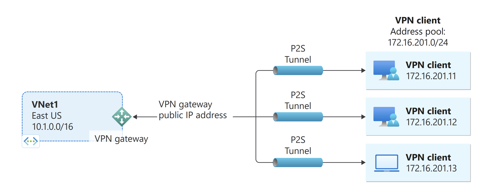

# VPN Gateway Component

This component provides VPN connectivity for AKS Flex Node using OpenVPN over Point-to-Site (P2S) connections. It's designed for scenarios where a limited number of clients need secure access to a virtual network.

## Overview

The VPN Gateway component enables secure connectivity between AKS Flex Nodes and Azure Virtual Networks through:

- **Certificate-based authentication** using self-generated root and client certificates
- **OpenVPN SSL tunnel** for encrypted communication
- **Automatic IP management** to update node IPs when VPN interface changes
- **Azure integration** for seamless VPN gateway configuration

## Steps
1. Prepare Azure Resources
- Create a GatewaySubnet within the AKS VNet
- Deploy a Route-based Azure VPN Gateway into the GatewaySubnet

2. Prepare Certificates
- root certificate: will be uploaded to Azure as a "trusted" cert (a Base64 encoded X.509 .cer file.)
- client certificates: generated from the root certificate and to be installed on each client computer for client authentication
  
3. Configure VPN client profile

## References

[Configure server settings for P2S VPN Gateway certificate authentication](https://learn.microsoft.com/en-us/azure/vpn-gateway/point-to-site-certificate-gateway)